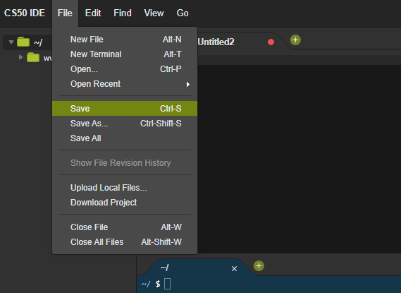

# An "About Me" Page in HTML
For this assignment, you will create a simple one-page "About Me" webpage using only HTML.

## Step-by-Step Setup
1. Login to your IDE at [ide.cs50.io](https://ide.cs50.io/)
2. You should see something that looks like this...
    
1. Click the plus sign and choose "New File"
    
2. Click File and then Save
    
3. Type in the name `aboutme.html` (all lower, no spaces)
    
4. Click Save
5. Copy the following HTML into that file
6. Save the file
7. In the terminal, type `http-server` and press enter
8. Click the link provided

## Now What?
Now that you've done that you can go back and forth between your file and your browser to work, save, and check.

1. Go back to the code in your IDE
2. Add stuff and/or make changes
3. Save
4. Go back to the browser
5. Refresh
6. Review
7. Rinse and Repeat

## Requirements
Create an HTML page that has at least

* ONE main heading (`h1`)
* TWO subheadings (`h2`)
* THREE paragraphs (`p`)
* ONE list (`ol` or `ul`)
* ONE link (`a`)

NOT REQUIRED, but see if you can also add an image.