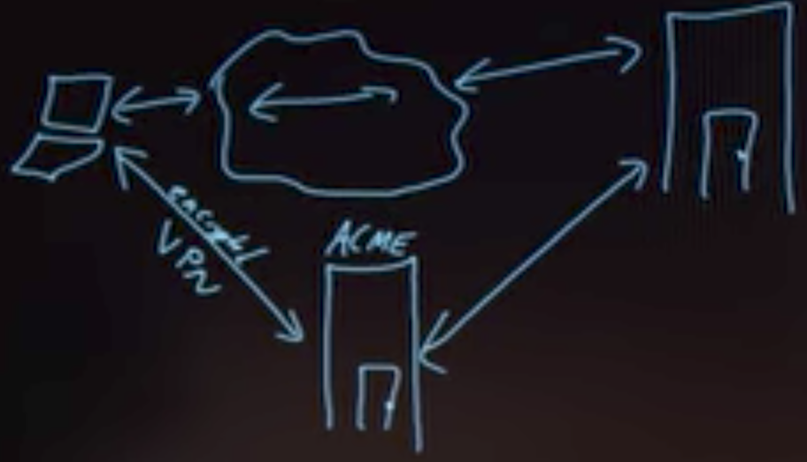
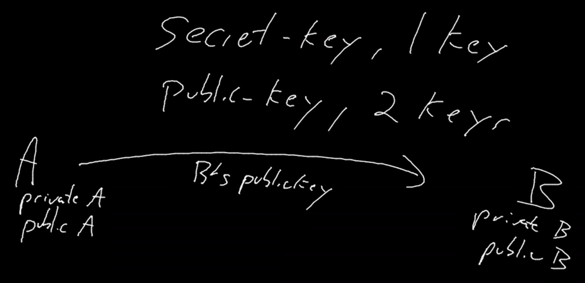
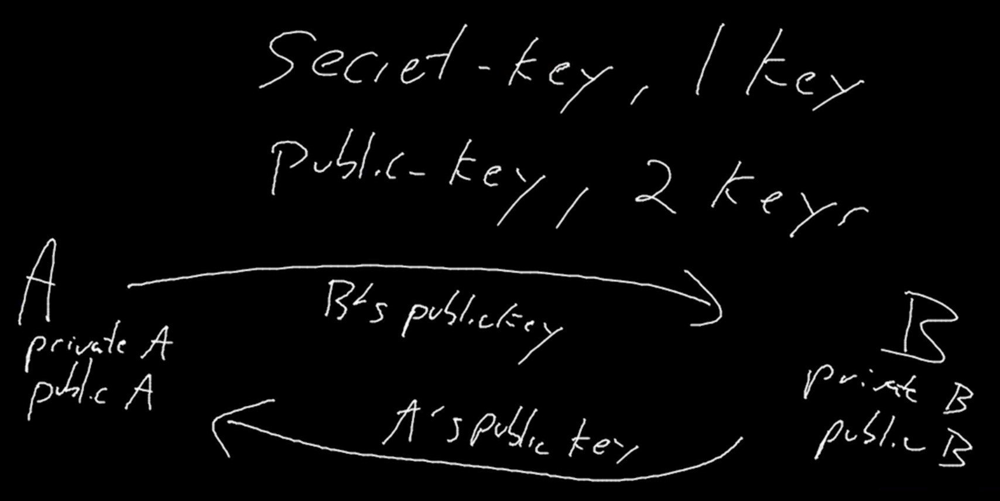
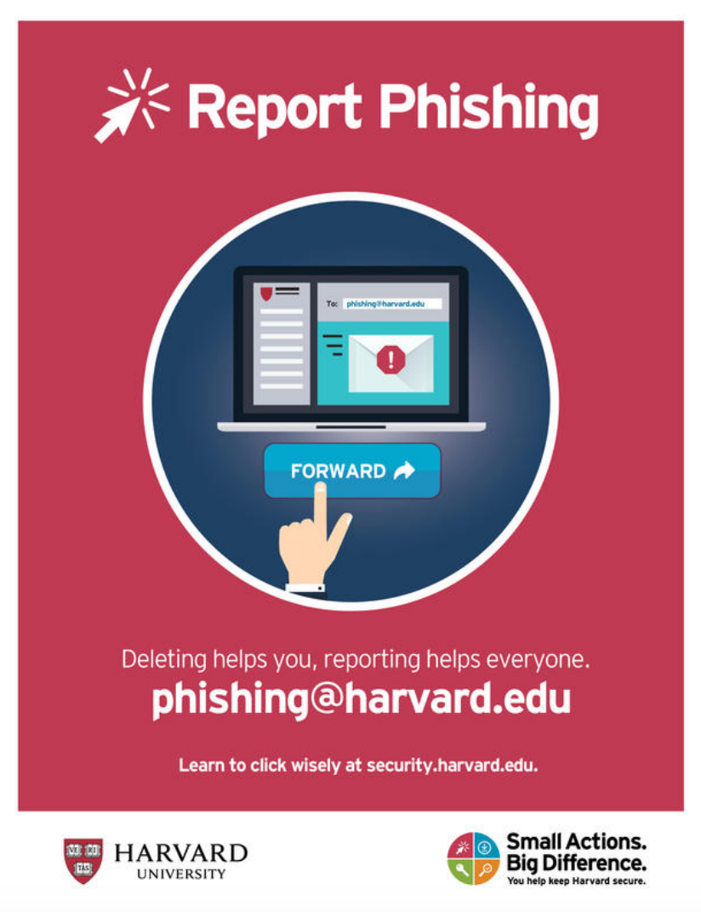

# Security

by Spencer Tiberi

## [Introduction](https://video.cs50.net/cscie1a/2017/fall/lectures/security?t=0m1s)

* Our data is under constant threat, but how can we defend ourselves?

## [Privacy](https://video.cs50.net/cscie1a/2017/fall/lectures/security?t=0m22s)

* Keeping people away from things you don't want them to see
* Computers are among the lease secure devices you own
  * Data or files are stored on them as 0s and 1s
    * Can be financial info, photos, etc.

## [Deleting Files](https://video.cs50.net/cscie1a/2017/fall/lectures/security?t=1m13s)

* What does it mean to delete a file off of a hard drive?
  * Visually, it disappears from a desktop or folder
* Files are stored on a computer as 0s and 1s
* Some space needs to be allocated for the file
* The operating system has a file that keeps track of files an their location on disk
* Graphically, when a file is deleted, it moves to the trash (or recycle bin)
  * It can still be easily revived from here, until you empty the trash
* However, an operating system doesn't actually delete it from the hard drive
  * It simply forgets the location and existence of the file!
  * One can theoretically recover data by looking for familiar patterns of bits
* So how do we delete more securely?
  * Re-saving a file with overridden information actually could not override the old bits but rather create more 0s and 1s stored on a hard drive!
  * Special software can wipe data off of a hard drive
* Who do computers have this obvious flaw with deleting?
  * What if we accidentally delete a file?
    * This structure allows for recovery
  * Wiping data also takes a lot of time, so it's much faster to just forget locations of data

## [Cookies](https://video.cs50.net/cscie1a/2017/fall/lectures/security?t=7m30s)

* A feature supported by HTTP
* Little values a web server puts on a user's browser
* Used to remember if a user has visited a website before
  * Allows you to not have to log in every time you visit or refresh a page
    * When you log into a web server, a cookie is planted on your browser
  * Stored in a database
  * Browser will send value to web server to remind of previous login
* When we make a request we send:
```
GET / HTTP/1.1
Host: example.com
```
* We receive:
```
HTTP/1.1 200 OK
Set-Cookie: session=29823bf3-075a-433a-8754-707d05c418ab
```
  * The server gives us a cookie.
* A cookie is like an ink-based hand stamp for an amusement park or club
* Wireless information can be intercepted
  * What if a hacker could obtain the cookie
    * Session hijacking attack
    * If you have already logged in, hacker can pretend to be you
* Encryption scrambles this value so hackers cannot easily use it
* Browser history remembers everywhere you've been and everything you've done there
  * Convenient if you want to recall a website you've visited
    * But, so can anyone else with access to your browser
* Can clear browser history and cookies
  * History likely not securely scrubbed
  * Will protect you from nosey friends
  * Websites will forget you visited as the cookies will be deleted as well!

## [Incognito Mode](https://video.cs50.net/cscie1a/2017/fall/lectures/security?t=17m12s)

* Can open up a typically different colored browser window
* Use if you want history automatically removed
* Useful when building a website as sometimes you want a browser to forget old iterations of your website build

## [Authentication](https://video.cs50.net/cscie1a/2017/fall/lectures/security?t=18m41s)

* All of this assumes you log in
* If you don't use a passcode to protect your device, anyone can pretend to be you
  * What if you lose your phone or device?

## [Passwords](https://video.cs50.net/cscie1a/2017/fall/lectures/security?t=20m6s)

* On a phone could only be a few digits
  * Not super secure
  * \__ \__ \__ \__
    * With numbers, each space has 10 options
    * 10 x 10 x 10 x 10 = 10,000 possibilities
    * 0000-9999
* On many smartphones, you will have to wait for an amount of time if you have entered a bad passcode
  * Slows down the process of someone guessing
* Add more digits or letters of the alphabet
 * Using a-z, A-Z, 0-9
 * \__ \__ \__ \__
  * Each space now has 62 options (26 + 26 + 10)
  * 62 x 62 x 62 x 62 = 14,776,336 possibilities
* Maybe you're super secure and you have a 20-char password
  * You could forget it
  * Annoying to type in repetitively
* No one fits all
  * Short = bad, longer = good
  * Don't use popular words and phrases
    * Hackers will look for words or common phrases
* Most common Passwords
  1. 123456
  2. 123456789
  3. qwerty
  4. 12345678
  5. 111111
  6. 1234567890
  7. 1234567
  8. password
  9. 123123
  10. 987654321
* Hackers have dictionaries of bad passwords that they can search through and try
* Random passwords
  * Usually have to confirm so it can be hard to replicate
* Using numbers to represent letter is common
  * 1 for l
  * 4 for A
* It's suggested you mix uppercase, lowercase, and and throw in numbers
  * Good to use misspellengs
* Don't put your post-it with your password on your monitor!
* Constant password changes can be a net negative
  * Can encourage easier passwords to help with memorization

## [Password Resetting](https://video.cs50.net/cscie1a/2017/fall/lectures/security?t=30m49s)

* What if you forget your password?
  * Often can click on a link to reset your password
    * Asks you to type email address or username
  * Typically, you get an email with a link
    * Hopefully this goes back to the same website!
    * It likely has a random value in the URL
  * Once back at the website, you update your password
* The website has a database
  * It generated a random number and stored it with a note indicating password recovery
  * The website assumes that anyone who has access to this value and to the user's email is you
* Typically, tech staff can't tell you what your password is
  * Odds are your password is encrypted (scrambled) or, more technically, hashed in their database
* Getting a password in email means that the password are not hashed or encrypted!
  * Also, sending a password over email opens that email to interception
  * This is a red flag if a website does this

## [Using The Same Password](https://video.cs50.net/cscie1a/2017/fall/lectures/security?t=35m52s)

* You may have a favorite password that you reuse
  * Upside is that it's convenient
* However, what if one of the websites are hacked?
  * A hacker may try to use the password on other websites to see what she or he can get into!

## [Password Managers](https://video.cs50.net/cscie1a/2017/fall/lectures/security?t=37m15s)

* Difficult to remember all these passwords
* Software called password managers exist that store on your phone or hard drive all usernames and passwords in an encrypted way
  * You have a master password that logs you into everywhere!
    * Store it physically in somewhere like a safety deposit box
* Password managers create long random passwords and will log in for you
  * All websites have different passwords!
* However, if you lose the master password, you cannot get the accounts back!

## [Two Factor Authentication](https://video.cs50.net/cscie1a/2017/fall/lectures/security?t=39m22s)

* First factor is a password
  * Historically, something "only" the user knows
  * Can be guessed
* Second factor should be fundamentally different
  * Should be something you have
    * An RSA device displays a unique value that is synced with a server
      {: width="400px"}
      * This number needs to be typed in too!
      * As long as this device isn't stolen by someone with your password, they can't get in as easily
    * Phones now run software that allows you to get a code and type them in
* Should think about what websites you care about the most and enable two factor authentication
  * Some companies can use sms (text messages)

## [Network security](https://video.cs50.net/cscie1a/2017/fall/lectures/security?t=43m31s)

* So many of our current networks are wireless
  * You probably been conditioned to look for free wifi
    * Sometimes still might not connect for various reasons
* If the wireless connection has not padlock (no password to log in) the connection is not secure
  * You may still visit https or secure websites
  * However, everything you do on http sites can be seen
* What to do?
  * Don't use that network
  * Use a VPN (Virtual Private Network)
    * Connection to internet is encrypted
    {: width="400px"}
      * With an unsecured connection, anyone can access your data

## [VPN](https://video.cs50.net/cscie1a/2017/fall/lectures/security?t=46m57s)

* First establish encrypted connection to a server and let this server communicate for you
  * The connection between the VPN server and website can still be insecure!
* Because we are encrypting data through an algorithm, using a VPN can slow down speed

## [Firewall](https://video.cs50.net/cscie1a/2017/fall/lectures/security?t=49m19s)

* A physical firewall is a wall between connected buildings that prevents the spread of fire
* In the world of computer science, a firewall is software that looks at IP addresses and helps keep bad guys out and user data inside
* Helps prevent people from accessing your computer

## [Encryption](https://video.cs50.net/cscie1a/2017/fall/lectures/security?t=51m4s)

* Suppose I want to send a secret message for "HI"
  * HI ➟ IJ
  * Change each letter by 1
  * The recipient needs to know how it changed to revert
* Plaintext ➟ Cyphertext ➟ Plaintext
  * HI ➟ IJ ➟ HI
* This is called a caesar cypher
  * Rotational cyphers are not that secure
    * Can be guessed easily
    * Not used for internet encryption
  * For this to work, recipient needs the key
    * To know the key, we need to agree in advance
      * Can't send it encrypted as well as they need the key!

## [Public Key Cryptography](https://video.cs50.net/cscie1a/2017/fall/lectures/security?t=54m44s)

* The last example with a caesar cypher is secret-key cryptography
  * Only one key
* In public key cryptography there are two keys, one public and one private
  * Mathematical relationship between them
  * Use public key to encrypt, private key to decrypt
  {: width="400px"}
  * Bob's private key can undo the effects of his public key
  * When Bob responds...
  {: width="400px"}
  * Bob sends a message using Alice's public key
* Your browser has its own public and private keys
  * So does websites like Google and Amazon
    * This allows them to communicate securely with you
* Often this processes is used to exchange a secret key

## [Phishing](https://video.cs50.net/cscie1a/2017/fall/lectures/security?t=58m28s)

* These kind of attacks have become so prevent that the following has been posted around Harvard's campus
  {: width="400px"}
* Phishing attacks are when an adversary sends a somewhat official-looking email
  * May contain a link asking for a password or account info
  * The email may contain an elaborate backstory "justifying" the request
  * The malicious email is trying to obtain information from you
* Odds are that the link provided doesn't go to the website being claimed
  * Can go to a website that looks legit
    * People can just copy HTML
* Results in giving up private information
* It's healthy to distrust most email you get
  * Don't follow links, type in the address for the company yourself
  * Sketchy emails may have typographical errors

## [Malware](https://video.cs50.net/cscie1a/2017/fall/lectures/security?t=1h2m10s)

* Malicious software can also be sent via email
* Windows is particularly vulnerable
* Software can be injected into your browser and your computer to erase your hard drive, make your computer send spam, or hold your data hostage
* Some malware encrypts your data and asks for large sums of money to get the key to decrypt it
  * Key could not even work!
  * This is called ransomware
* Malware can ultimately do anything on your computer

## [Trust](https://video.cs50.net/cscie1a/2017/fall/lectures/security?t=1h3m53s)

* At the end of the day, all of security and privacy boils down to trust
  * People around you
  * Algorithms/software
  * Manufacturers
* We've downloaded software with trust that it will only do what it claims
  * Word could log your key strokes
  * Chrome could monitor you even when not on Google's website
  * Snapchat could not delete posts after being seen
* There have been cases where software was written to cover tracks of being monitored!
* Who's to say the software we're using is actually doing what we say?
* It's east to curl up into a ball and worry, but we need to decide who to trust
* Security measures make it more difficult for someone to be malicious, but ultimately they can't guarantee privacy
* You have to decide what data you're comfortable with storing, what you view on the internet, who to trust, and how much to trust them
