# Lecture 0
{:.no_toc}

* TOC
{:toc}

## Welcome

* When David was a first year, he was too intimidated to take any computer science courses. By the time he was a sophomore, he found the courage to take the equivalent of CS50, but only pass/fail.
* In fact, two-thirds of CS50 students have never taken a CS course before.
* And importantly, too:
  > what ultimately matters in this course is not so much where you end up relative to your classmates but where you end up relative to yourself when you began

## What is computer science?

* Computer science is fundamentally problem-solving.
* We can think of problem-solving as the process of taking some input (details about our problem) and generate some output (the solution to our problem). The "black box" in the middle is computer science.\\
  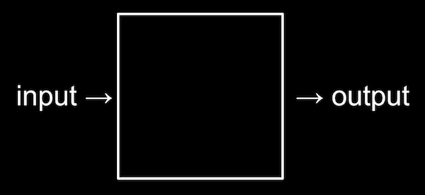
* We need a way to represent inputs, such that we can store and work with information in a standard way.

## Binary

* A computer, at the lowest level, stores data in binary, a numeral system in which there are just two digits, 0 and 1.
* When we first learned to count, we might have used one finger to represent one thing. That system is called unary. When we learned to write numbers with the digits 0 through 9, we learned to use decimal.
* For example, we know the following represents one hundred and twenty-three.
  <pre>
  1 2 3
  </pre>
  * The `3` is in the ones column, the `2` is in the tens column, and the `1` is in the hundreds column.
  * So `123` is 100×1 + 10×2 + 1×3 = 100 + 20 + 3 = 123.
  * Each place for a digit represents a power of ten, since there are ten possible digits for each place.
* In binary, with just two digits, we have powers of two for each place value:
  <pre>
  4 2 1
  <b>0 0 0</b>
  </pre>
  * This would still be equal to 0.
* Now if we change the binary value to, say, `0 1 1`, the decimal value would be 3.
  <pre>
  4 2 1
  <b>0 1 1</b>
  </pre>
* If we wanted to represent 8, we would need another digit:
  <pre>
  8 4 2 1
  <b>1 0 0 0</b>
  </pre>
* And binary makes sense for computers because we power them with electricity, which can be either on or off, so each bit only needs to be on or off. In a computer, there are millions or billions of switches called transistors that can store electricity and represent a bit by being "on" or "off".
* With enough bits, or binary digits, computers can count to any number.
* 8 bits make up one **byte**.

## Representing data

* To represent letters, all we need to do is decide how numbers map to letters. Some humans, many years ago, collectively decided on a standard mapping called [ASCII](https://en.wikipedia.org/wiki/ASCII). The letter "A", for example, is the number 65, and "B" is 66, and so on. The mapping also includes punctuation and other symbols. Other characters, like letters with accent marks, and emoji, are part of a standard called [Unicode](https://en.wikipedia.org/wiki/Unicode) that use more bits than ASCII to accommodate all these characters.
  * When we receive an emoji, our computer is actually just receiving a decimal number like `128514` (`11111011000000010` in binary, if you can read that more easily) that it then maps to the image of the emoji.
* An image, too, is comprised of many smaller square dots, or pixels, each of which can be represented in binary with a system called RGB, with values for red, green, and blue light in each pixel. By mixing together different amounts of each color, we can represent millions of colors:\\
  
  * The red, green, and blue values are combined to get a light yellow color:\\
    
* We can see this in an emoji if we zoom in far enough:
  
* And computer programs know, based on the context of its code, whether the binary numbers should be interpreted as numbers, or letters, or pixels.
* And videos are just many, many images displayed one after another, at some number of frames per second. Music, too, can be represented by the notes being played, their duration, and their volume.

## Algorithms

* So now we can represent inputs and outputs. The black box earlier will contain *algorithms*, step-by-step instructions for solving a problem:\\
  
* Let's say we wanted to find a friend, Mike Smith, in a phone book.
  * We could start by flipping through the book, one page at a time, until we find Mike Smith or reach the end of the book.
  * We could also flip two pages at a time, but if we go too far, we'll have to know to go back a page.
  * But an even more efficient way would be opening the phone book to the middle, decide whether Mike will be in the left half or right half of the book (because the book is alphabetized), and immediately throw away half of the problem. We can repeat this, dividing the problem in half each time. With 1024 pages to start, we would only need 10 steps of dividing in half before we have just one page remaining to check.
* In fact, we can represent the efficiency of each of those algorithms with a chart:\\
  
  * Our first solution, one page at a time, is like the red line: our time to solve increases linearly as the size of the problem increases.
  * The second solution, two pages at a time, is like the yellow line: our slope is less steep, but still linear.
  * Our final solution, is like the green line: logarithmic, since our time to solve rises more and more slowly as the size of the problem increases. In other words, if the phone book went from 1000 to 2000 pages, we would need one more step to find Mike. If the size doubled again from 2000 to 4000 pages, we would still only need one more step.

## Pseudocode

* We can write *pseudocode*, an informal syntax that is just a more specific version of English (or other human language) that represents our algorithm:
  <pre>
  1  Pick up phone book
  2  Open to middle of phone book
  3  Look at page
  4  If Smith is on page
  5      Call Mike
  6  Else if Smith is earlier in book
  7      Open to middle of left half of book
  8      Go back to line 3
  9  Else if Smith is later in book
  10     Open to middle of right half of book
  11     Go back to line 3
  12 Else
  13     Quit
  </pre>
* Some of these lines start with verbs, or actions. We'll start calling these *functions*:
  <pre>
  1  <b>Pick up</b> phone book
  2  <b>Open to</b> middle of phone book
  3  <b>Look at</b> page
  4  If Smith is on page
  5      <b>Call</b> Mike
  6  Else if Smith is earlier in book
  7      <b>Open to</b> middle of left half of book
  8      Go back to line 3
  9  Else if Smith is later in book
  10     <b>Open to</b> middle of right half of book
  11     Go back to line 3
  12 Else
  13     <b>Quit</b>
  </pre>
* We also have branches that lead to different paths, like forks in the road, which we'll call *conditions*:
  <pre>
  1  Pick up phone book
  2  Open to middle of phone book
  3  Look at page
  4  <b>If</b> Smith is on page
  5      Call Mike
  6  <b>Else if</b> Smith is earlier in book
  7      Open to middle of left half of book
  8      Go back to line 3
  9  <b>Else if</b> Smith is later in book
  10     Open to middle of right half of book
  11     Go back to line 3
  12 <b>Else</b>
  13     Quit
  </pre>
* And the questions that decide where we go are called *Boolean expressions*, which eventually result to a value of true or false:
  <pre>
  1  Pick up phone book
  2  Open to middle of phone book
  3  Look at page
  4  If <b>Smith is on page</b>
  5      Call Mike
  6  Else if <b>Smith is earlier in book</b>
  7      Open to middle of left half of book
  8      Go back to line 3
  9  Else if <b>Smith is later in book</b>
  10     Open to middle of right half of book
  11     Go back to line 3
  12 Else
  13     Quit
  </pre>
* Finally, we have words that lead to cycles, where we can repeat parts of our program, called *loops*:
  <pre>
  1  Pick up phone book
  2  Open to middle of phone book
  3  Look at page
  4  If Smith is on page
  5      Call Mike
  6  Else if Smith is earlier in book
  7      Open to middle of left half of book
  8      <b>Go back to line 3</b>
  9  Else if Smith is later in book
  10     Open to middle of right half of book
  11     <b>Go back to line 3</b>
  12 Else
  13     Quit
  </pre>

## Scratch

* We can write programs with the building blocks we just discovered:
  * functions
  * conditions
  * Boolean expressions
  * loops
* We'll use a graphical programming language called [Scratch](https://scratch.mit.edu/), where we'll drag and drop blocks that contain instructions.
* Later in our course, we'll move onto textual programming languages like C, and Python, and JavaScript. All of these languages, including Scratch, has more powerful features like:
  * variables
    * the ability to store values and change them
  * threads
    * the ability for our program to do multiple things at once
  * events
    * the ability to respond to changes in our program or inputs
  * ...
* The programming environment for Scratch looks like this:\\
  
  * On the left, we have puzzle pieces that represent functions or variables, or other concepts, that we can drag and drop into our instruction area in the center.
  * On the right, we have a stage that will be shown by our program to a human, where we can add or change backgrounds, characters (called sprites in Scratch), and more.
* We can drag a few blocks to make Scratch say "hello, world":\\
  
  * The "when green flag clicked" block is the start of our program, and below it we've snapped in a "say" block and typed in "hello, world".
* We can also drag in the "ask and wait" block, with a question like "What's your name?", and combine it with a "say" block for the answer:\\
  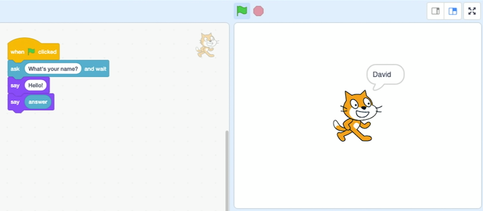
* But we didn't wait after we said "Hello" with the first block, so we can use the "say () for () seconds" block:\\
  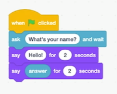
* We can use the "join" block to combine two phrases so Scratch can say "hello, David":\\
  
  * Notice that we can nest instructions and variables.
* In fact, the "say" block itself is like an algorithm, where we provided an input of "hello, world" and it produced the output of Scratch (the cat) "saying" that phrase:\\
  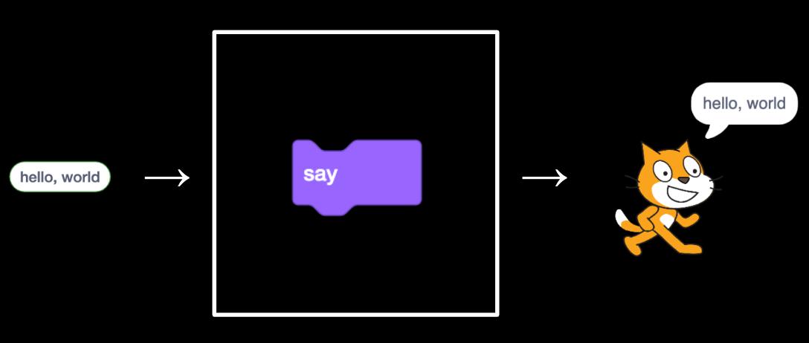
* The "ask" block, too, takes in an input (the question we want to ask), and produces the output of the "answer" block:\\
  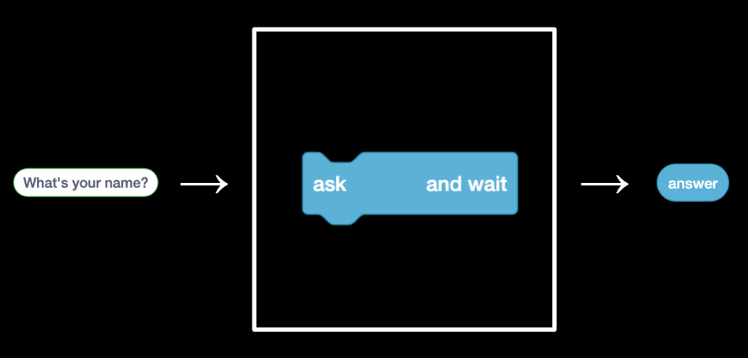
* We can then use the "answer" block along with our own text, "hello, ", as two inputs to the join algorithm ...\\
  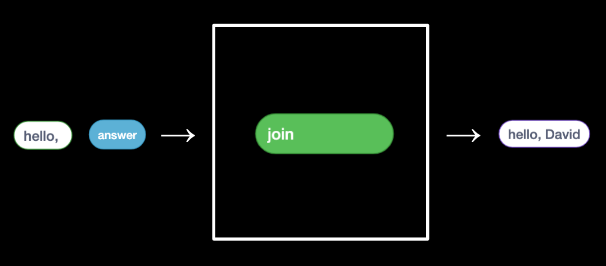
* ... which we pass as input again to the "say" block:\\
  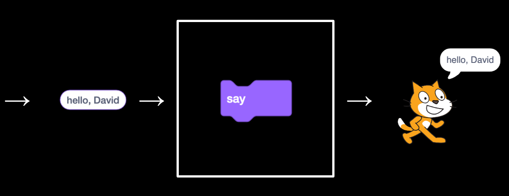
* We can try to make Scratch (the name of the cat) say meow:\\
  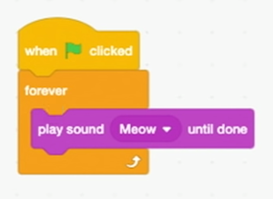
  * But when we click the green flag, we hear the meow sound over and over immediately. Our first bug, or mistake! We can add a block to wait, so the meows sound more normal.\\
    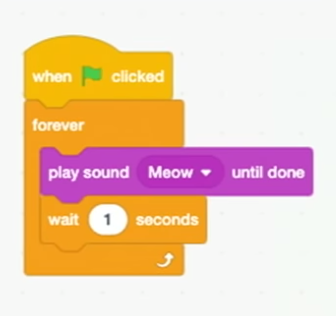
* We can have Scratch point towards the mouse and move towards it:\\
  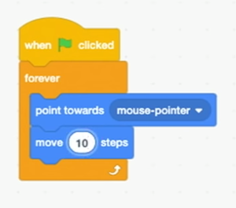
* We'll look at a sheep that can count:\\
  
  * Here, `counter` is a variable, the value of which we can set, use, and change.
* We can also have Scratch meow if we touch it with the mouse pointer:\\
  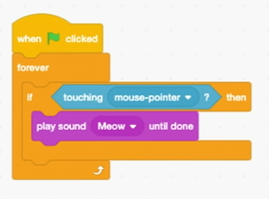
* Alternatively, we can have Scratch roar if we do:\\
  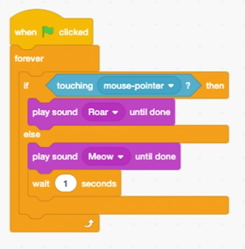
  * Here, we have two different branches, or conditions, that will repeat forever. If the mouse is touching it, Scratch will "roar", otherwise it will just meow.
* We can make Scratch move back and forth on the screen with a few more blocks we can discover by looking around:\\
  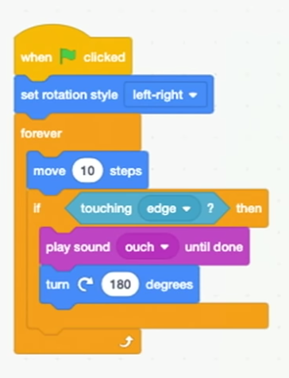
  * We can even record our own sound to play.
* With two different "costumes," or images of Scratch with its legs in different positions, we can even simulate an animated walking motion:\\
  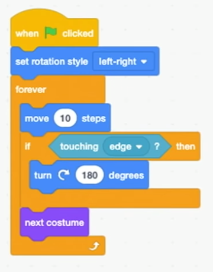
* We look at another program, bark, where we can use the space bar to mute a sea lion:\\
  
  * We have a variable, `muted`, that's `false` by default. And our program will constantly check if the space bar is pressed, and set muted to `false` if it's `true`, or `true` if not. This way, we can toggle whether the sound plays or not, since our other set of blocks for the sea lion check the `muted` variable:\\
  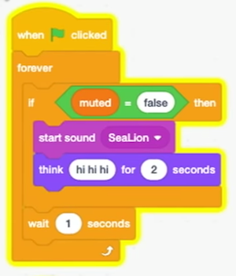
* With multiple sprites, or characters, we can have different sets of blocks for each of them:\\
  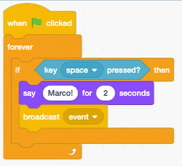
  * For one puppet, we have these blocks that say "Marco!", and then a "broadcast event" block. This "event" is used for our two sprites to communicate with each other, like sending a secret message. So our other puppet can just wait for this event to say "Polo!":\\
    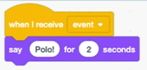
* Now that we know some basics, we can think about the design, or quality of our programs. For example, we might want to have Scratch cough three times by repeating some blocks:\\
  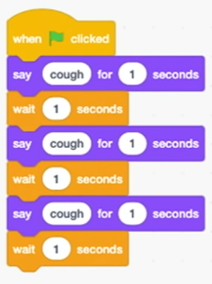
* While this is correct, we can avoid repeating blocks with a loop:\\
  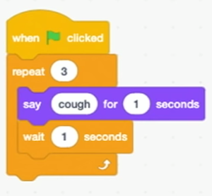
* The next step is abstracting away some of our code into a function, or making it reusable in different ways. We can make a block called "cough" and put some blocks inside it:\\
  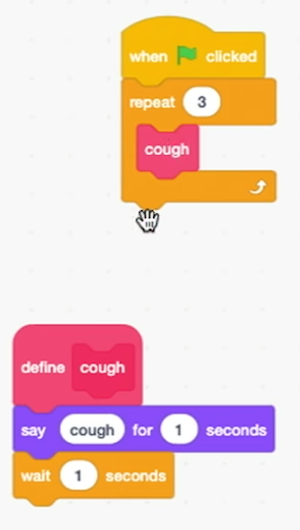
  * Now, all of our sprites can use the same "cough" block, in as many places as we'd like.
* We can even put a number of times into our cough function, so we only need a single block to cough any number of times:\\
  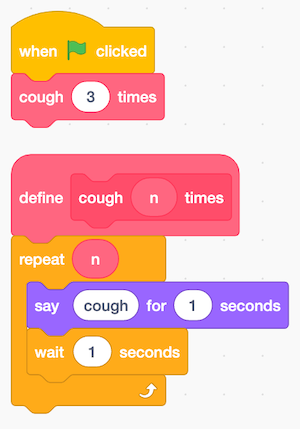
* We look at some examples and discuss how we might implement components of them with different sprites that follow the mouse cursor, or cause something else to happen on the stage.
* Welcome aboard!
