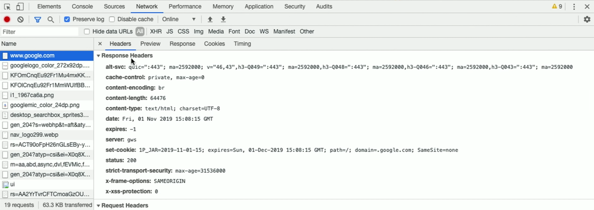
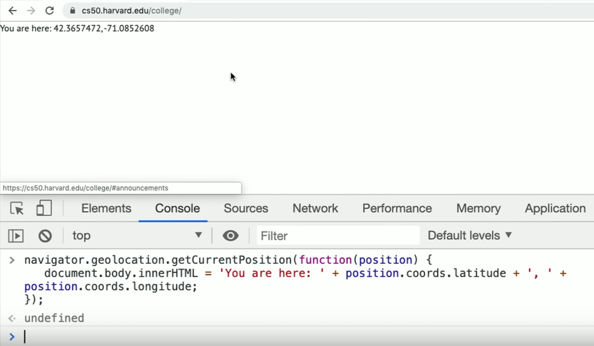

# Lecture 8
{:.no_toc}

* TOC
{:toc}

## A Look Back

* Just a few weeks ago, 2/3rd of us had never taken a CS course before. We started with making programs in Scratch, struggled through using C to write loops and eventually implementing more applicable algorithms, and finally took advantage of higher-level languages like Python and its packages, and SQL, to solve even more interesting problems.
* In week 0, we said:
  * what ultimately matters in this course is not so much where you end up relative to your classmates but where you end up relative to yourself when you began
  * And now we can look back to see how far we've come.
* Indeed, David's own notes from when he took CS50 in 1996 includes concepts like algorithms, functions, and arguments.
* To start solving problems with algorithms, we need to represent inputs and outputs. So we can use binary to represent data, whether that's numbers, letters, or pixels in images.
* We demonstrate binary search in a phone book by dividing the book in half each time.
* Precision and correctness are both critical in programming, since computers can't infer "what we mean". We demonstrate this with a volunteer giving the audience instructions on how to draw an image. We see that abstractions ("draw a stick figure") can be useful, but we lose some precision when we use them.

## Privacy

* Computer science, in essence, is about the processing and storage of information. But we need to also consider not just _what_ we can do, but _whether_ we should do it.
* For example, we use passwords to protect many of our accounts and data, but the top 10 passwords are just:
  1. 123456
  2. 123456789
  3. qwerty
  4. password
  5. 111111
  6. 12345678
  7. abc123
  8. 1234567
  9. password1
  10. 12345
* But unfortunately, even a more complex password can be quickly guessed by modern computers. We can write a program in just a few minutes, that will generate all possible PINs and check them. We can even open a dictionary file that has all English words, and iterate over each of them.
* Cookies are small pieces of data that websites store on our computers when we visit them, useful for identifying us such that we don't have to log in on every visit, but can also be used for advertising and tracking purposes.
* In Chrome, we can use View > Developer > Developer Tools to see the cookies that a particular site leaves under the "Network" tab:\\
  
* And on other websites, where Google's ads might be embedded, Google can track us there, too, with the same cookie.
* And the request that our web browser sends to each site also includes a string called "user-agent", which describes the version of the browser we have.
* On the internet, too, we have unique IP addresses that identify us so that we can receive responses from servers.
* We also explored how we might recover "deleted" photos in a problem set, and services like Snapchat that promise to delete photos after some time, may not actually remove the data.
* In fact, a "soft delete" might set a value of "deleted" to be "true" to hide it from us, but the rest of the data is still stored.
* Photos of ourselves on social media, too, can help someone else track us, what we do, and who we're with.
* In the Chrome's Developer Tools again, we can run some code in a website that prompts us to share our location and then puts it on the screen:\\
  
* We'll now have the opportunity to explore one of four tracks: web programming, mobile app development for either iOS or Android, and game development with Lua.
* With these new skills, we'll be working on a final project of our own design, solving a problem in the real world that we're interested in.
* We'll have an overnight hackathon, focused on collaborating with classmates and staff on our final projects.
* Finally, we'll have the CS50 Fair, where we'll celebrate our final projects to friends and visitors.
* We give a big thanks to our staff, without whom this course would not be possible!
