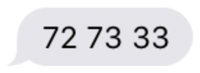

# Quiz 2

## Question 1 of 3

{: style="list-style-type: lower-alpha"}
1.  Suppose that you've just received the text message below.

    

    Assuming the text message is represented using [ASCII](https://www.cs.cmu.edu/~pattis/15-1XX/common/handouts/ascii.html), what sequence of bits (or, if you prefer, decimal digits) did you actually receive?

1.  Suppose that you've just received the below text message instead.

    

    Assuming the text message is represented using [ASCII](https://www.cs.cmu.edu/~pattis/15-1XX/common/handouts/ascii.html), what sequence of bits (or, if you prefer, decimal digits) did you actually receive?

1.  Why are those sequences not the same?

## Question 2 of 3

Recall that, in lecture, we saw how to write programs in C that support command-line arguments. To do so, we modified the program's `main` function to take two arguments: `argc` and `argv`.

{: style="list-style-type: lower-alpha"}
1. What's a program you've used already in CS50 that accepts command-line arguments? Name the program and describe what the command-line arguments are used for.
1. What is stored in `argc`? What is its type?
1. What is stored in `argv`? What is its type?

## Question 3 of 3

Recall that, in lecture, we saw the following two for loops, both of which print the characters of a string, `s`, one character per line.

**Version 1**
```c
for (int i = 0; i < strlen(s); i++)
{
    printf("%c\n", s[i]);
}
```

**Version 2**
```c
for (int i = 0, n = strlen(s); i < n; i++)
{
    printf("%c\n", s[i]);
}
```

{: style="list-style-type: lower-alpha"}
1. In your own words, what is a `string`?
1. In both of the above functions, the function `strlen` is used to get the length of the string `s`. Given what you know about how strings are represented in C, how does `strlen` likely compute the length of the string?
1. Which of these two versions of the code is more efficient? In what way is it more efficient?
